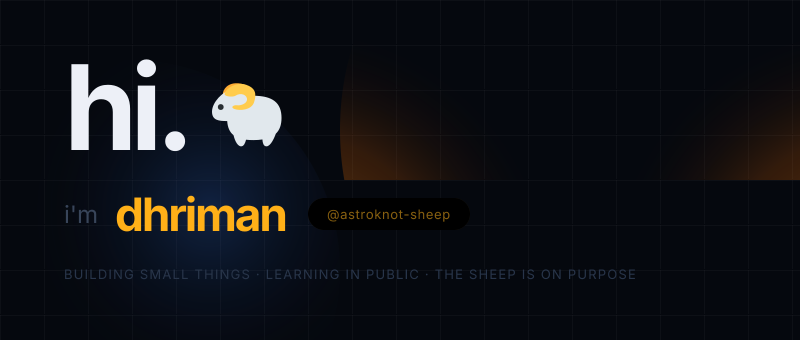
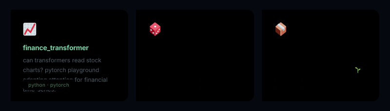

<!-- hey. thanks for stopping by. -->

i don't have a grand mission statement.\
i just like building small things that *might* help someone.

***

## what i'm fiddling with right now

<strong>📈 finance_transformer</strong> — can transformers read stock charts?

 
• python + pytorch playground 
• adapting attention for continuous financial time-series 
• spoiler: sometimes it works. mostly it confuses noise for signal. still fun. 
👉 <a href="https://github.com/astroknot-sheep/finance_transformer">see the code</a>

<strong>🎲 DQN for Ludo</strong> — teaching AI to play better than my cousins

 
• double dqn + prioritized replay + chai breaks 
• math notes included (no jargon without explanation) 
👉 <a href="https://github.com/astroknot-sheep/Reinforcement_Learning_DQN_for_Ludo">see the code</a>

<strong>📦 other experiments</strong>

 
• <a href="https://github.com/astroknot-sheep/TWS_WriterAgent">TWS_WriterAgent</a> — playful agent prototyping 
• <a href="https://github.com/astroknot-sheep/ML_project_final">ML_project_final</a> — completed learning journey 
• <a href="https://github.com/astroknot-sheep/mlproject">mlproject</a> — early sandbox 
• <a href="https://github.com/astroknot-sheep/data-gravity-portfolio">data-gravity-portfolio</a> — fresh sprouts 🌱

***

## tools i use (and sometimes fight with)

i'm not an expert in any of these.\
i just keep showing up.

***

## want to interact? here's how. (no bots, no dead links)

### 🎲 quick game

guess which repo has a hidden comment that says `"you found me 🐑"`.\
open an issue with the answer. first one gets my eternal gratitude + a detailed code review of your choice.

### 💬 ask me anything

* how do i start with RL?
* why does my transformer keep overfitting?
* how do i structure a proper ML project from scratch?
* what's your favorite chai spot?

→ just open an issue. no question is too small.\
→ or start a discussion: [here](https://github.com/astroknot-sheep/astroknot-sheep/discussions)

### 🤝 want to collaborate?

if you're working on:

* ethical AI
* financial ML experiments
* weird RL applications
* or just want to pair-program and learn…

…hit me up. i reply. (usually within 48 hrs.)

***

## real talk

i'm not trying to "disrupt" anything.\
i'm just:

* learning in public
* sharing half-baked ideas
* hoping one of them sticks and helps someone

if that resonates —\
→ star a repo\
→ fork and break something\
→ open a discussion\
→ or just wave 👋

i see you. and i appreciate you being here.

***

> p.s. if you read this whole thing:\
> you're either very curious or very bored.\
> either way — welcome. 🫶
>
> p.p.s. the sheep was definitely on purpose.

<!-- last updated: May 2026, sometime after midnight
